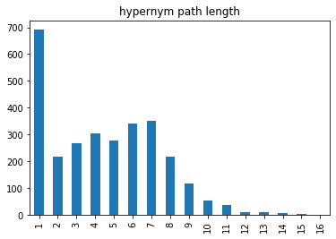

```{r setup, include=FALSE}
knitr::opts_chunk$set(echo = TRUE)
require(readr)
require(ggplot2)
require(mgcv)
require(mgcViz)
require(qgam)
require(dplyr)
```

# Bilingual ontological wordnet

essentially a Chinese translation of Wordnet 1.6 synsets

## an item in BOW
```
ID	MEAN	EXAM	TRANSLA	SYNSET	WORD1	POS	SUMO	SUMO_Chinese	MILO	MILO_Chinese
00003582R	in an unkind manner or with unkindness	"The teacher treats the children unkindly"	無情地 ＠ 苛刻地 ＠ 不近人情地	unkindly,	unkindly	R	SubjectiveAssessmentAttribute	主觀評價屬性	
00003965A	drawing to an end	"his declining years"	即將結束的	declining,	declining	A	EndFn	（時間）結束函式
```

From the raw data in BOW, we extracted those items with Chinese words as their translations, and converted them into following format:

```
word,synset,pos
無情,unkindly.r.01,R
```

hypernymy paths
```
[[Synset('entity.n.01'),
  Synset('life_form.n.01'),
  Synset('animal.n.01'),
  Synset('chordate.n.01'),
  Synset('vertebrate.n.01'),
  Synset('mammal.n.01'),
  Synset('placental.n.01'),
  Synset('carnivore.n.01'),
  Synset('feline.n.01'),
  Synset('cat.n.01')]]
```

```
number of entries in BOW: 99642
number of Chinese single-character words found in BOW:  3324
number of unique single-character words:  1472
number of unique synset:  2903
all mentioned synsets:  4531
```




```{r read_data}
m2=read_csv("../../data/bow/m2_cld_wn.csv")
m2$lexicality = factor(m2$lexicality, labels=c("Word", "NonWord"))
m2$ErrCat = factor(m2$ERR > 50, levels=c(T, F), labels=c("ErrHigh", "ErrLow"))
m2$C1nSense = log(m2$C1nSense+1)
m2$C2nSense = log(m2$C2nSense+1)
m2$C1Friends = log(m2$C1Friends+1)
m2$C2Friends = log(m2$C2Friends+1)
m2$C1Frequency = log(m2$C1Frequency+1)
m2$C2Frequency = log(m2$C2Frequency+1)
```
## Descriptive statistics
```{r eyeballing}
xtabs(~m2$lexicality+is.na(m2$path_sim_max))
dim(m2)
head(m2)
```

```{r vis_m2}
ggplot(m2, aes(x=RT, color=lexicality)) + 
    geom_rug() + 
    geom_density(lwd=1) + 
    facet_wrap(~ErrCat)
```

## Non-word

```{r non-word-1}
m2_nonword = m2 %>% 
          subset(lexicality=="NonWord") %>%
          select(c("RT", "ERR", "vec_dist_min", "path_sim_max", grep("C[12].", colnames(m2)))) %>%
          mutate(RTinv = -1000/RT)
print(sum(is.nan(m2$path_sim_max)))
head(m2_nonword)
```
## Model with vector distances only

```{r non-word-gam-1}
gam_nw_1 = gam(RTinv~te(C1Frequency, C2Frequency)+s(vec_dist_min), data=m2_nonword)
summary(gam_nw_1)
print(concurvity(gam_nw_1))
```

```{r non-word-gam-plot-1}
plot(gam_nw_1, select=1)
plot(gam_nw_1, select=2)
vis.gam(gam_nw_1, view=c("C1Frequency", "C2Frequency"), plot.type='contour', too.far=0.1, color='topo')
```

## Model with path similarities only

```{r non-word-gam-2}
gam_nw_2.1 = gam(RTinv~te(C1Frequency, C2Frequency)+s(path_sim_max), data=m2_nonword)
summary(gam_nw_2.1)
print(concurvity(gam_nw_2.1))
```

```{r non-word-gam-plot-2}
plot(gam_nw_2.1, select=1)
plot(gam_nw_2.1, select=2)
vis.gam(gam_nw_2.1, view=c("C1Frequency", "C2Frequency"), plot.type='contour', too.far=0.1, color='topo')
```


## Model with path similarities and vector distances

```{r non-word-gam-2.2}
gam_nw_2.2 = gam(RTinv~te(C1Frequency, C2Frequency)+s(vec_dist_min)+s(path_sim_max), data=m2_nonword)
summary(gam_nw_2.2)
print(concurvity(gam_nw_2.2))
```

```{r non-word-gam-plot-2.2}
plot(gam_nw_2.2, select=1)
plot(gam_nw_2.2, select=2)
plot(gam_nw_2.2, select=3)
vis.gam(gam_nw_2.2, view=c("C1Frequency", "C2Frequency"), plot.type='contour', too.far=0.1, color='topo')
```


# Word

```{r word-1}
m2_word = m2 %>% 
          subset(lexicality=="Word") %>%
          select(c("RT", "ERR", "vec_dist_min", "path_sim_max", grep("C[12].", colnames(m2)))) %>%
          mutate(RTinv = -1000/RT)
head(m2_word)
```


```{r word-gam}
gam_wd_1 = gam(RTinv~te(C1Frequency, C2Frequency)+s(vec_dist_min), data=m2_word)
summary(gam_wd_1)
print(concurvity(gam_wd_1))
```

```{r word-gam-plot}
plot(gam_wd_1, select=1)
plot(gam_wd_1, select=2)
vis.gam(gam_wd_1, view=c("C1Frequency", "C2Frequency"), plot.type='contour', too.far=0.1, color='topo')
```